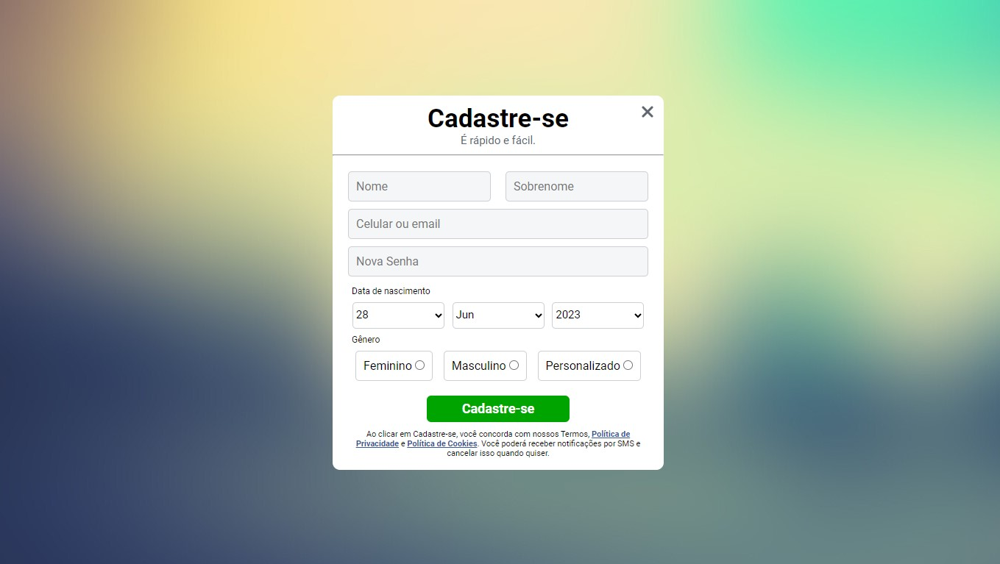

# Formulário de Cadastro

Esse projeto é baseado no formulário de cadastro atual do Facebook. Nele, coloquei em prática a criação de formulários em HTML e a estilização usando CSS.

### 🔗 Links

- [Deployment no Github Pages](https://fransuelton.github.io/formulario-de-cadastro/)

### ✨ Tecnologias Utilziadas

- HTML5
- CSS
- Flexbox

### 📚 Aprendizado

Aprendi a fazer validações usando HTML puro e a criar a estrutura de um formulário simples com os métodos GET e POST. No entanto, como não é muito complexo, foi utilizado o método GET, onde as informações enviadas são incorporadas à URL.

### 📫 Contribuindo para o projeto

Para contribuir com esse projeto siga estas etapas:

1. Bifurque este repositório.
2. Crie um branch: `git checkout -b <nome_branch>`.
3. Faça suas alterações e confirme-as: `git commit -m '<mensagem_commit>'`
4. Envie para o branch original: `git push origin <nome_do_projeto> / <local>`
5. Crie a solicitação de pull.

### Obrigado por visitar meu repositório!❤️