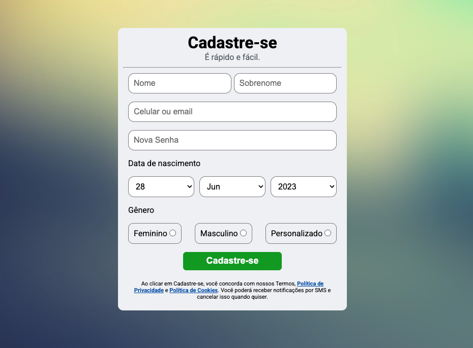

# 🚀 authForm


📌 Responsive registration form that communicates with the AuthJS API. A project created for study purposes, applying best practices for code organization, frontend-backend integration, and professional folder structure.

---

## 📚 Table of Contents

- [🚀 authForm](#-authform)
  - [📚 Table of Contents](#-table-of-contents)
  - [📝 About](#-about)
  - [✨ Features](#-features)
  - [🧰 Tech Stack](#-tech-stack)
    - [📦 Core Technologies](#-core-technologies)
  - [🖼️ Screenshots](#️-screenshots)
  - [🚀 Getting Started](#-getting-started)
    - [📋 Prerequisites](#-prerequisites)
    - [🔧 Installation](#-installation)
  - [📁 Simple Folder Structure](#-simple-folder-structure)
  - [🎯 What I Learned](#-what-i-learned)
  - [📄 License](#-license)
  - [📬 Contact](#-contact)

---

## 📝 About

This project is based on the current Facebook registration form. In it, I put into practice the creation of forms in HTML and styling using CSS.

Now is a refactor of a previous registration form, now updated with a modern design, professional folder structure, and real integration with my own authentication API, [AuthJS](https://github.com/Fransuelton/auth-js).

---

## ✨ Features

- 🔐 Integration with authentication API (real user registration)
- 🎨 Modern and responsive design
- ⚒️ Well-organized code (services, utils, styles)
- ✅ Frontend and backend field validation

---

## 🧰 Tech Stack

### 📦 Core Technologies

[](https://skillicons.dev)

- **Frontend:** HTML5, CSS3, Vanilla JavaScript
- **Backend (API):** Node.js, Express.js, MongoDB, JWT, bcrypt

---

## 🖼️ Screenshots

| Registration Form |
|-------------------|
|  |

---

## 🚀 Getting Started

### 📋 Prerequisites

- Modern web browser
- API backend running (AuthJS) or hosted

### 🔧 Installation

```bash
# Clone the repository
git clone git@github.com:Fransuelton/auth-form.git

# Navigate to the project folder
cd auth-form

# Open the index.html file in your browser
```

## 📁 Simple Folder Structure

```plaintext
authForm/
├── src/
│   ├── assets/
│   ├── styles/
│   │   ├── main.css
│   ├── scripts/
│   │   └── index.js
├── README.md
├── index.html
```

## 🎯 What I Learned

- How to structure a simple frontend project
- Real-world form integration with a REST API
- Best practices for folder and code organization
- Frontend and backend validation working together

---

## 📄 License

This project is licensed under the MIT License. See the [LICENSE](./LICENSE) file for details.

---

## 📬 Contact

**Fransuelton Francisco**  
📫 contato@fransuelton.dev  
🌐 [fransuelton.dev](https://fransuelton.dev)  
🐙 [github.com/Fransuelton](https://github.com/Fransuelton)  
💼 [linkedin.com/in/fransuelton](https://www.linkedin.com/in/fransuelton)  

---

⭐️ If you found this project helpful or inspiring, consider leaving a star!