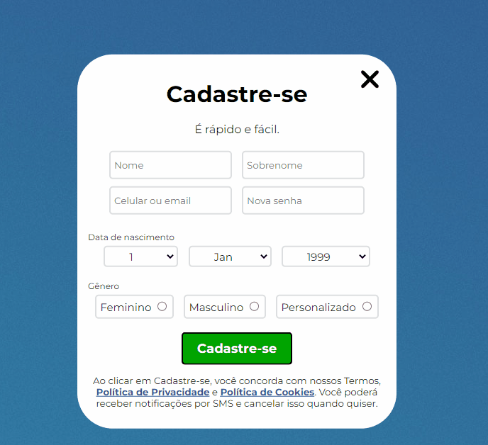

# Formulário de Cadastro




>Usei meus conhecimentos adquiridos até agora para construir esse simples formulário de cadastro. 🚀📚

## 💻 Tecnologias Utilizadas:


          

## ☕ Como utilizar:

1° Clone o repositório
```
git clone url-do-repositorio
```
2° Ou acesse o deploy do formulário [Clicando aqui](https://fransuelton.github.io/formulario-de-cadastro/).

## 📫 Contribuindo para Formulário de cadastro

Para contribuir com esse projeto siga estas etapas:

1. Bifurque este repositório.
2. Crie um branch: `git checkout -b <nome_branch>`.
3. Faça suas alterações e confirme-as: `git commit -m '<mensagem_commit>'`
4. Envie para o branch original: `git push origin <nome_do_projeto> / <local>`
5. Crie a solicitação de pull.

## Obrigado por visitar meu repositório!❤️

